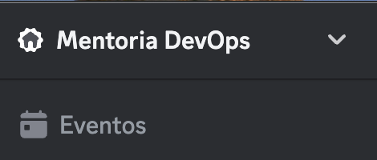

# Mentoria DevOps

## O que é a mentoria DevOps?
É um projeto que visa promover o compartilhamento de conhecimentos por meio de um coletivo de pessoas engajadas em mentorar pessoas que estejam interessadas em aprender sobre tecnologia em geral e DevOps e também colaborar com projetos de software livre. 

De forma bem resumida, a mentoria é um espaço onde pessoas que sabem mais podem ajudar a pessoas que sabem menos e tem vontade de aprender.

## O que NÃO É a mentoria DevOps?
O projeto da mentoria DevOps não é:
* Um projeto pago.
* Uma entidade vinculada a algum órgão.

## Como funciona?

Antes de começar a explicar como funciona o projeto, é importante dizer que toda a comunicação do projeto é centralizada em um servidor no [Discord](https://discord.com/).

### Canais do servidor do Discord

Quando entrar no servidor no Discord, vai ver canais (onde acontecem as discussões sobre atividades e dúvidas em geral) de texto e áudo/video, os principais canais de texto são:
* `#geral`: canal para conversas diversas, dúvidas e qualquer assunto que não se encaixe nos outros canais
* `#apresente-se`: canal onde você tem a oportunidade de se apresentar logo que entrar no servidor
* `#tematico-<tecnologia>`: esses são canais de texto específicos para tecnologias ou tópicos, aqui é onde pode tirar dúvidas e compartilhar o que achar relevante sobre aquela tecnologia específica.

Você pode conferir todos os eventos agendados na parte superior do menu lateral esquerdo:

### Atividades

A mentoria DevOps possui projetos principais que estão sendo trabalhados e atendem a iniciativas de software livre, mas não quer dizer que obrigatoriamente você precisa estar atuando em atividades relacionadas a esses projetos.

Por exemplo, quer estudar sobre uma tecnologia específica? quer montar um grupo para estudar para uma certificação? Converse sobre isso no canal `#geral` ou `#tematico-<tecnologia>` e caso haja interesse crie uma agenda para isso!

As demandas atendidas pelas mentoria podem ser consultadas nesse *board* público: https://github.com/orgs/mentoriadevops/projects/1

Você pode acompanhar todos os resultados dos projetos da mentoria na [organização do GitHub aqui](https://github.com/mentoriadevops).

## Perguntas Frequentes
### Entrei no servidor do Discord, o que fazer?
Assim que entrar no servidor, se apresente no canal `#apresente-se`, veja os eventos agendados e veja o *board* dos projetos em andamento. 

## Código de Conduta
Toda a comunicação é regida por um código de conduta, você pode ver os detalhes [aqui](https://github.com/DadosAbertosDeFeira/guias/blob/main/CODIGO_DE_CONDUTA.md).